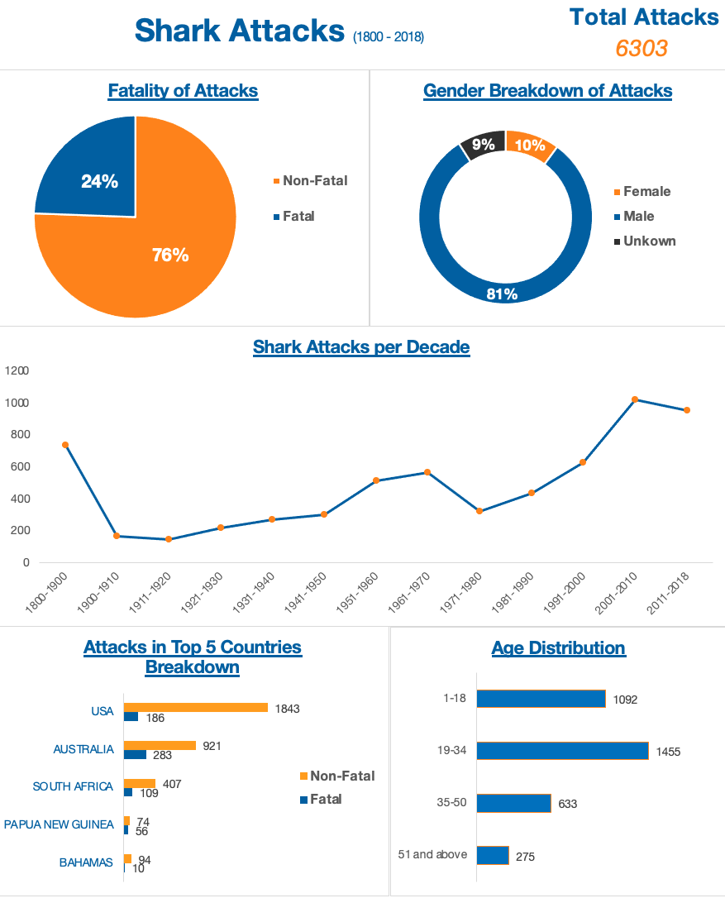

# Shark Attacks Dashboard

This project revolves around the analysis of shark attacks data spanning from the 1900 onwards. The dataset, sourced from [Kaggle]([https://www.kaggle.com/your-kaggle-dataset-link](https://www.kaggle.com/datasets/mysarahmadbhat/shark-attacks)), was carefully processed and transformed to develop a visually appealing dashboard, capturing multiple dimensions of these encounters.

## 📊 Dashboard Highlights

The dashboard encompasses the following visualizations:

1. **Fatality of Attacks**: Showcasing the count of fatal vs. non-fatal attacks.
2. **Gender Breakdown of Attacks**: Highlighting the distribution based on gender.
3. **Attacks in Top 5 Countries**: Focusing on countries with the highest occurrence.
4. **Age Distribution**: Detailing the age groups most commonly involved.
5. **Trend of Shark Attacks Per Decade**: Providing a historical overview.

## 🔍 Potential Inferences

- **Increased Maritime Activities**: The high frequency of shark attacks in the USA, Australia, South Africa, Papua New Guinea, and the Bahamas can be attributed to their extensive coastlines with popular beaches, rich marine biodiversity, and increased maritime activities. However, the prominence of attacks in these regions doesn't necessarily indicate high fatality rates, thanks to effective safety measures and public awareness campaigns.
- **Nature of Sharks**: The fatality rates can offer insights into sharks' behavior. It is clear that the majority of attacks (3/4) are non fatal. 
- **Safety Over Time**: Interestingly, the data reveals a consistent rise in shark attacks over the decades. This uptick could be attributed to the growth in coastal tourism and an expanding human presence in marine environments for leisure and various activities.
- **Age Group Behavior**: The data reveals a noticeable trend in age distribution among shark attack victims. The age group 19-34 experienced the highest number of attacks, suggesting that younger adults are more frequently involved in activities that may expose them to such risks. This is followed by the 1-18 age bracket. Interestingly, the frequency diminishes with advancing age; This could be attributed to older individuals partaking less in water-related activities or perhaps being more cautious.
- **Gender Disparities**: While over 80% of the attack victims are male, a more in-depth analysis is needed to draw any definitive conclusions.

## 📈 Future Directions

Further research can incorporate correlating the data with other factors like maritime activities, coastal population density, or specific shark species' prevalence in particular regions.
